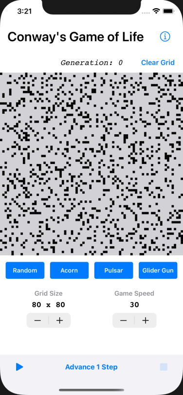
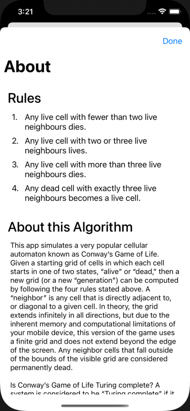

# Game of Life
---
#### Cellular Automata and Conway's "Game of Life"

Welcome to John Conway's "Game of Life"! This is a computer science
classic from 1970, a program that simulates a _cellular automaton_
(plural _automata_). It has connections to all kinds of different
aspects of computer science and nature.

[from Wikipedia](https://en.wikipedia.org/wiki/Conway%27s_Game_of_Life#Examples_of_patterns)

# Screenshots

## Collaboration

This is a solo project.

## MVP Features

#### Visualizing the "Game of Life"

The main entry point of your application should house the visualization
of this cellular automaton. Include necessary components, such as:

* Grid to display cells. 
* Cell objects or components that, at a minimum, should have:
  * Properties
    * current state: (alive, dead), (black, white)
    * Tappable:
      * can be tapped to allow user to setup initial cell configuration
      * should NOT be tappable while simulation is running
    * Behaviors
      * Toggle state functionality: switch between alive & dead either
        because user manually toggled cell before starting simulation or
        simulation is running and rules of life caused cell to change
        state
* An appropriate data structure to hold a grid of cells that is at least
  25x25. Go as big as you want.
* Text to display current generation # being displayed
  * Utilize a timeout function to build the next generation of cells &
    update the display at the chosen time interval
* Button(s) that start & stop the animation
* Button to clear the grid

Write an algorithm that:

* Implements the following basic steps:
  * For each cell in the current generation's grid:
    1. Examine state of all eight neighbors (it's up to you whether you
       want cells to wrap around the grid and consider cells on the
       other side or not)
    2. Apply rules of life to determine if this cell will change states
    3. When main loop completes:
       1. Swap current and next grids
       2. Repeat until simulation stopped
* Breaks down above steps into appropriate sub-tasks implemented with
  helper functions to improve readability
* Uses double buffering to update grid with next generation.
* Does something well-documented with the edge of the grid. (e.g. wrap
  around to the far side--most fun!--or assumes all edge cells are
  permanently dead.)

### Custom Features

Implement at least 3 of the following features:

- [x] Create a few sample cell configurations that users can load and run
- [x] Add an option that creates a random cell configuration that users can
  run
- [x] Allow users to specify the speed of the simulation
- [x] Provide functionality to manually step through the simulation one
  generation at a time, as opposed to animating automatically
- [x] Allow users to change the dimension of the grid being displayed

#### About

* On the main entry point of the application, include a separate section
  or link to another page or popup that describes the two main rules
  (birth & death) of Conway’s Game of Life
